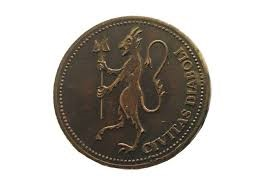

# Teufelsmünze

Eine Münze mit der lateinischen Aufschrift: 'civitas diaboli', auf Deutsch 'Das Reich des Teufels'

Sie wurde von Sir Charles bei seinem Tod fallen gelassen und von [Alexander](../../../helden/Alexander_Doppler/index.md) aufgehoben. Sie kommt [Janette](../../../personen/München/Janette%20Landgraf/index.md) sehr bekannt vor. In einem Buch hat sie diese schon einmal besichtigt.

