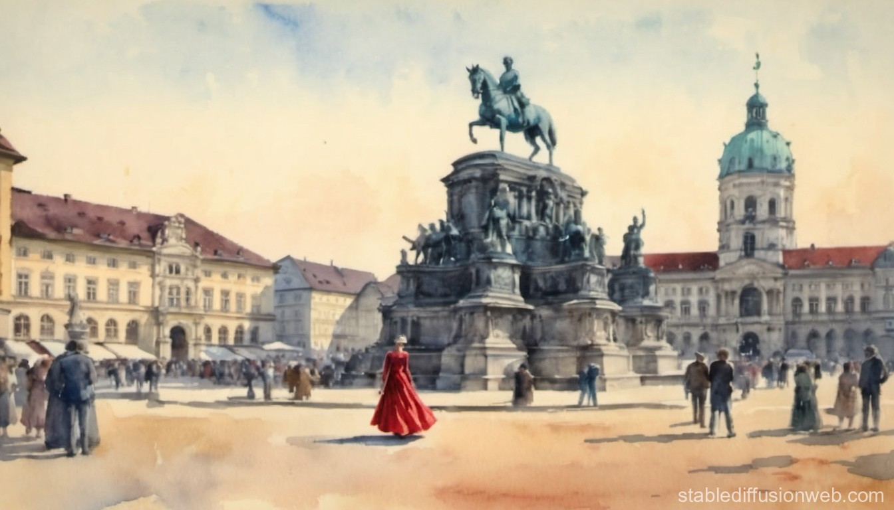

## Paradoxon

| Datum:                     |  23.11.2024                      |
|    ---                     |---                               | 
|**Spielleiter:**| **Julian** |
| **Teilnehmer:**    |   **[Alexander Doppler](../../helden/Alexander_Doppler/index.md)  \| [Friedrich Pfeiffer](../../helden/Friedrich_Pfeiffer/index.md) \| [Marina Adamantidi](../../helden/Marina_Adamantidi/index.md) \| [Maximilian Lanzinger](../../helden/Maximilian%20Lanzinger/index.md)**|          
| **Veranstaltungsort:**        | **Online** | 
| **Spielzeit:**                | **Donnerstag 03.04.1882**            |
| **Schauplätze:**                | **[München](../../orte/Bayern/München/index.md)**            |
| | **[Café Luitpold](../../orte/Bayern/München/Cafe%20Luitpold/index.md)** |

## Prolog

Um sich von viel Arbeit und Strapazen zu erholen treffen sich die Helden im neu eröffneten [Café Luitpold](../../orte/Bayern/München/Cafe%20Luitpold/index.md) am Wittelsbacherplatz in [München](../../orte/Bayern/München/index.md). Dort werden sie in eine wilde Geschichte rund um eine junge Frau in rotem Kleid, ihren zukünftigen Ehemann und ihren Enkel der eine mysteriöse Uhr in seinem Besitz, und gleichzeitig im Besitz seines Opas ist. Verworren und verwirrend bis in das letzte Detail.

---

## Hauptteil

An einem schönen Tag im sonnigen München sitzen **[Alexander Doppler](../../helden/Alexander_Doppler/index.md), [Friedrich Pfeiffer](../../helden/Friedrich_Pfeiffer/index.md), [Marina Adamantidi](../../helden/Marina_Adamantidi/index.md), mit ihrem Hund [Johnny](../../tiere/Johnny/index.md), und [Maximilian Lanzinger](../../helden/Maximilian%20Lanzinger/index.md) **| rund um einen Tisch in latender Faulenzerheit.
„Ihr sitzt zusammen, an einem warmen Frühlingstag, in dem neu eröffneten Café Luitpold am Wittelsbacherplatz. Außerhalb des erneuerten Gebäudes habt ihr euch einen Tisch in der Nähe des reich von Holz verzierten Eingangs gesucht. Gemütlich lasst ihr euch die Strahlen der Sonne durch eine aufblühende Blätterdecke ins Gesicht scheinen und atmet die nach Frische und Erneuerung duftende Luft. Vor euch stehen die von euch bestellten Speisen und Getränke, feine Kreationen von Meisterhand, sei es aus Tradition oder fernen Landen, während um euch herum reges Treiben von Gästen und Personal besteht. Ein älteres Paar hinter Maximilian erzählt von Träumen, bereits erlebt oder vergangen und auch ihr seid vertieft in allerlei Gespräche, ob lustig oder traurig, wissenschaftlich und philosophisch. Ein Tag der wahrlich kaum besser sein kann und euch mit Wonne und Wohlgefühl erfüllt. Welche Gedanken durchziehen euren Geist?“

Die Helden reden über ihre Erlebnisse über die letzten Monate, und bestellen sich leckere Getränke. Alexander hat an einem Artikel über "Akkustik und Schwingungen beim Anbringen von metallenen Gegenständen", Marina besuchte einen exzessiven Nähkurs, Friedrich hat an einem langen Seminar über Mediation und Gesprächstherapie teilgenommen und Maximilian hat sich mit dem Umgang von Messern beschäftigt. Alle konnten auch ihre Fähigkeiten im Umgang mit dämonischen Begebenheiten verbessern und bei den [Custodire](../../gruppierungen/Custodire%20Populum/index.md) ihre Technik mit ausgewählten Waffen verfeinern. 

Mitten in ihrer Unterhaltung werden sie von einem markerschütternden Schrei und einem lauten Knall unterbrochen. Auf der anderen Straßenseite fleht eine gestürzte junge Frau in rotem Kleid, umringt von verwirrten Passanten. Gegenüber von ihr wurde ein junger Mann mit schwarzen Haar und Brille zu Boden gerungen, schreiend nicht vor Schmerz sondern Verzweiflung. In seiner einen Hand hällt er eine kleine Pistole, die andere bewegt sich in seiner Jackeninnentasche. Und gerade dann birgt sich vor den Augen der Helden ein feuriger Kreis und eine dämonische Melodie. Kaum is dieses komische Gefühl vorbei...

„Ihr sitzt zusammen, an einem warmen Frühlingstag, in dem neu eröffneten Café Luitpold am Wittelsbacherplatz. Außerhalb des erneuerten Gebäudes habt ihr euch einen Tisch in der Nähe des reich von Holz verzierten Eingangs gesucht. Gemütlich lasst ihr euch die Strahlen der Sonne durch eine aufblühende Blätterdecke ins Gesicht scheinen und atmet die nach Frische und Erneuerung duftende Luft. Vor euch stehen die von euch bestellten Speisen und Getränke, feine Kreationen von Meisterhand, sei es aus Tradition oder fernen Landen, während um euch herum reges Treiben von Gästen und Personal besteht. Ein älteres Paar hinter Maximilian stutzt verwirrend vor sich hin und auch ihr seid vertieft in allerlei Gespräche, ob lustig oder traurig, wissenschaftlich und philosophisch. Ein Tag der wahrlich kaum besser sein kann und euch mit Wonne und Wohlgefühl erfüllt. Welche Gedanken durchziehen euren Geist?“

Kurz verdutzt nehmen die Vier ihre Gespräche wieder auf, doch ein Dorn in ihrem Hinterkopf lässt sie wenig ruhen. Genauso wie das Ehepaar hinter ihnen. Wenig zurückhaltend frägt der bärtige Mann in bayerischer Tracht ob es den Helden genauso erging wie ihm und seiner Ehefrau. Die beiden stellen sich als [Jörg](../../personen/München/Jörg%20Ratzinger/index.md) und [Clara Ratzinger](../../personen/München/Clara%20Ratzinger/index.md) aus Grünwald vor. Aber es ist wohl nur dieses Ehepaar, welches ähnliche komische Erinnerungen hat. Den als die Kellnerin nach einer bestellung fragt scheint alles wieder vergessen und Friedrich gönnt sich erstmal ein Bier. Wieder in DIskussion vertieft ertönnt dieses mal erst der Frauenschrei aber kein Schuss. Anscheinend war der Attentäter diesmal gestolpert und konnte nicht feuern, oder zum ersten Mal gestolpert? Wieder stürzen sich Passanten auf ihn um doch schnell greift er wieder in seine Jacke und alles um unsere Held verschwimmt in Gemurmel und Flammen.

„Ihr sitzt zusammen, an einem warmen Frühlingstag, in dem neu eröffneten Café Luitpold am Wittelsbacherplatz. Außerhalb des erneuerten Gebäudes habt ihr euch einen Tisch in der Nähe des reich von Holz verzierten Eingangs gesucht. Gemütlich lasst ihr euch die Strahlen der Sonne durch eine aufblühende Blätterdecke ins Gesicht scheinen und atmet die nach Frische und Erneuerung duftende Luft. Vor euch stehen die von euch bestellten Speisen und Getränke, ein kühles Bier und feine Kreationen von Meisterhand, sei es aus Tradition oder fernen Landen, während um euch herum reges Treiben von Gästen und Personal besteht. Ein älteres Paar hinter Maximilian stutzt verwirrend vor sich hin und auch ihr seid vertieft in allerlei Gespräche, ob verdutzt oder fragend. Ein Tag der wahrlich kaum besser sein kann und euch mit Wonne und Wohlgefühl erfüllt. Welche Gedanken durchziehen euren Geist?“

Jetzt bleiben mehr Erinnerungen, eine Frau in einem roten Kleid, ein Mann mit einer Waffe. Alles gegenüber auf dem Platz. Wieder ein verwirrtes Ehepaar hinter euch, noch mehr verrückt als zuvor, auch Johnny ist verstört. Direkt bestellt sich Friedrich ein "zweites" Bier, wieder hat niemand anderes ewtas bemerkt. Es wird ein Plan geschmiedet, alle außer Alexander gehen zum Platz und suchen dort die Frau und den Mann. Maximilian wirft einen Blick auf seine Taschenuhr: 13:37. Alexander beginnt die Szene zu skizzieren, den Plan auf hoffentlich unvergägnliches Papier zu bringen. Marina erblickt schnell die junge und hübsche Frau in Rot und verwickelt diese in ein Gespräch über Mode, während Johhn treu die nähere Um,gebung absichert. Lange muss gewartet werden, da erscheint der junge und merkwürdig in dunklem Leder gekleidete Mann wieder auf dem Platz und steuert direkt auf die Frau in rot zu. Doch Friedrich und Maximilian sind direkt zu stelle und bringen diesen zu Fall. Die Pistole wird gezogen, doch hält die starke Hand Friedrichs dieese auf den Boden gerichtet, jeglicher gelöste Schuss wäre so nutzlos. Wimmernt und flehend greift der erschöpfte Mann in Schwarz in seine Jackentasche und noch bevor Maximilian diese ergreifen kann dreht sich wieder alles um die Helden. Außer Alexander, für diesen scheint keine Zeit vergangen zu sein...

„Ihr sitzt zusammen, an einem warmen Frühlingstag, in dem neu eröffneten Café Luitpold am Wittelsbacherplatz. Außerhalb des erneuerten Gebäudes habt ihr euch einen Tisch in der Nähe des reich von Holz verzierten Eingangs gesucht. Gemütlich lasst ihr euch die Strahlen der Sonne durch eine aufblühende Blätterdecke ins Gesicht scheinen und atmet die nach Frische und Erneuerung duftende Luft. Vor euch stehen die von euch bestellten Speisen und Getränke, feine Kreationen von Meisterhand, sei es aus Tradition oder fernen Landen, während um euch herum reges Treiben von Gästen und Personal besteht. Ein älteres Paar hinter Maximilian stutzt verwirrend vor sich hin und Alexander blickt etwas aufgeschreckt drein, so wie einmal vorher. Die anderen haben aber klare Erinnerungen, sie wissen nun mehr als vorher. Ein Tag der wahrlich kaum besser sein kann und euch mit Wonne und Wohlgefühl erfüllt. Welche Gedanken durchziehen euren Geist?“

Schnell ist klar, Alexander war von diesem wiederholenden Effekt nicht beeinflusst. Auch das Ehepaar scheint zu sein wie zuvor. Die Geduld verleirend rennt nun Maximilian einfach los, auf der Suche nach einem Ausweg. Oder nach etwas mehr? So weit und schnell ihn seine Füße tragen rennt er gen Norden. Im hintergerufen haben Maximilian und Marina, doch der eiserne Entschluss ist gefasst und Friedrich ist nicht mehr zu stoppen. Alexander hat den gleichen Plan eine Skizze anzufertigen, doch er wird direkt aufgefordert in der Reichweite der beiden anderen zu bleiben. Gewiss hat es etwas mit einer Verzauberung, oder Fluch, oder Gegenstand zu tun. Marina hinterlässt am Tisch den größten Geldschein den sie in ihrer Geldbörse findet und gibt der Kellnerin fast einen Herzinfakt.
Wieder wird die Frau in Rot umstellt, in alle Richtungen Ausschau gehalten und diese beschützt. Wieder spricht Marina sie an, stelt sich vor. Und wir erfahren ihren Namen, [Janette Landgraf](../../personen/München/Janette%20Landgraf/index.md), eine Bibliothekarin in der bayerischen Hof- und Staatsbibliothek. Anstatt länger auf den zukünftigen Mörder zu warten führt Marina Janette auf den Odeonsplatz und nimmt die anderen mit. Von dort gehen sie zur teuren Maximilianstraße, denn von hier hat Janette ihr neues Kleid gekauft. Gemeint ist der Laden Jaeques' Träumereien und dort ist im Inneren alles was nicht kleidung oder Mensch ist von Goldplatinen übersäht. Während die Damen sich über Mode und mehr über Janette unterhalten suchen die Männer weiter nach dem baldigen Mörder. Es ist 13:52 Uhr.
Und Friedrich rennt und schwitzt bis er schließlich wieder an Ort und Stelle sitzt, ein Bierglass in der Hand und die anderen fukosierter den je vor ihm sitzen.

„Ihr sitzt zusammen, an einem warmen Frühlingstag, in dem neu eröffneten Café Luitpold am Wittelsbacherplatz. Außerhalb des erneuerten Gebäudes habt ihr euch einen Tisch in der Nähe des reich von Holz verzierten Eingangs gesucht. Angespannt lasst ihr euch die Strahlen der Sonne durch eine aufblühende Blätterdecke ins Gesicht scheinen und atmet die nach Frische und Erneuerung duftende Luft. Vor euch stehen die von euch bestellten Speisen und Getränke, feine Kreationen von Meisterhand, sei es aus Tradition oder fernen Landen, während um euch herum reges Treiben von Gästen und Personal besteht. Ein älteres Paar hinter Maximilian stutzt verwirrend vor sich hin und Alexander blickt von seinem Zeichenblock auf, während Friedrich gemütlich und ohne Anstrengung einen Schluck nimmt. Die anderen haben aber klare Erinnerungen, sie wissen nun mehr als vorher. Ein Tag der wahrlich kaum furchterregender und mysteriöser werden. Welche Gedanken durchziehen euren Geist?“

Alles geht ganz schnell. Bevor sich Friedrich wieder ein Bier bestellen kann wird er eingewiesen und ein Plan gefasst um den Mörder zu fangen. Wieder hinterlässt Marina viel zu viel Trinkgeld und die Helden nehmen Aufstellung rund um den Wittelsbacherplatz. Verstecke werden gesucht und gefunden, nur Friedrich hat es etwas schwer.
Dieses mal spricht niemand die schöne Frau in Rot an, man lässt sie einfach auf den Platz laufen. Dort beginnt sie das Reiterstandbild für Kurfürst Maximilian I. von Bayern zu betrachten, aber wirkt im Ganzen nicht mehr so frisch wie vorher. War sie auch von der Zeitreise betroffen? Bald taucht auch der schwarze Mann auf und geht zeilgerichtet auf die Statue zu. Friedrich beginnt sich schon von hinten anzuschleichen und wird ihn auch noch rechtzeitig erreichen.
Doch während der Mann kurz vor Maximilian steht hält er kurz Inne. "Ma-?", mehr kommt nicht aus seinem Mund und er hebt die Waffe und schießt, doch dieses mal auf Max. Getroffen von dem kleinen Kaliber geht er zu Boden, Gottseidank war es nur seine Schulter. Bevor die Waffe auf Janette gerichtet wird greift Friedrich von hinten zu unt hält diese fest in seiner starken Hand.
Und jetzt sieht er auch, dass in der anderen Hand ein Gegenstand lauert, faustgroß und aus bläulich blitzenden Metall. Und dann dreht sich wieder alles.

„Ihr sitzt zusammen, an einem warmen Frühlingstag, in dem neu eröffneten Café Luitpold am Wittelsbacherplatz. Außerhalb des erneuerten Gebäudes habt ihr euch einen Tisch in der Nähe des reich von Holz verzierten Eingangs gesucht. Angespannt lasst ihr euch die Strahlen der Sonne durch eine aufblühende Blätterdecke ins Gesicht scheinen während Maximilian aus seiner schmerzenden Schusswunde langsam blutet. Ein Tag der wahrlich kaum furchterregender und endloser werden kann. Welche Gedanken durchziehen euren Geist?“

Maximilian wird direkt von Marina mit Nadel und Faden versorgt. Ein glatter Durchschuss aber sein Mantel wieder einmal dahin. Mna ist sich nicht im Klaren was wirklich zumn Erfolg führen könnte. Ein Auflauern auf dem Platz bringte bisher nichts, doch was sollte man sonst tun? Alexander kommt auf die Idee bei der Staatsbibliothek zu suchen. Denn dort hatte Janette bis vor kurzem gearbeitet und sollte nun in den Feierabend. Vielleicht ist sie noch dort, den vielleicht wurde sie diesmal auch von dem Effekt der Zeit beinflusst?
Mit der Ersten Hilfe beendet beisst Maximilian seinen Kiefer zusammen, diser Mord darf nicht geschehen! Auf zur Bibliothek! Und genau dort findet man sie, den Kopf haltend und unvorsichtige Schritte wankend auf den Aufgangstreppen der Bibliothek. Schnell umstellt tritt Marina wieder an sie heran und Janette kann sich an sie erinnern. Was also war es, dass die Zeit in Erinnerung behält?
Maximilian erspäht den gesuchten Mann, doch bleibt dabei unentdeckt vom Gegenüber. Er schleicht sich an diesen heran, kauernd hinter einer Ecke des Bibliotheksgebäudes. Der junge Mann ist erschöpft und blickt mürrisch drein, doch gefasst unklammert er seine kleien Waffe.
Es muss für ihn einen guten Grund geben so viel auf sich zu nehmen und diesen Mord durchzuführen. Durch die Zeit, hin und zurück. War er vielleicht so gar im Recht?
Doch ohne Zweifel an der Rettung der Frau stürmt Maximilian von hinten und umgreift die Waffenhand, doch seine verletzte Schulter raubt ihm seine Kraft. Langsam senkt sich die Kimme in Richtung Janette. Diesmal zögert Friedrich nicht mit seiner Waffe, zielt schnell und drückt gleich ab. Ein Schuss ins Bein, wie im Lehrbuch, lässt den Mörder einknicken und Maximilian komplett unversehrt. Allen Kräften beraubt und ernsthaft verletzt verliert der Mann sein Bewusstsein.

---

## Epilog

Und erwacht in einer warmen Zelle irgendwo unter München, in einem gesicherten Abschnitt von Kellern der Custodire Popolum. Die Wunde verbunden und Essen und Trinken vor dem Bett fühlt sich [Hans](../../personen/Köln/Hans%20Landgraf/index.md) besser als die Tage zuvor, irgendie geborgen.
Seinen selbstgestellten Auftrag konnte er aber nicht abschließen und nun kommt das erdrückende Gefühl der Angst zurück. Diese Menschen, seine Vorfahren müssen nun alles von ihm erfahren und hoffentlich können sie etwas an allem ändern.

Und so erzählt Hans Landgraf von seiner Zeit. Von seinen Großeltern Janette und Maximilian und wie diese die Uhr zum Laufen gebracht haben. Gerade diese Fakten bringen das zukünftige Paar zum erröten. Aber wird nun auch alles in KLraft treten, nun das man von seinem eigenen Schicksal weiß?
Und was ist mit den [Deutsch Patrioten](../../gruppierungen/Deutsch%20Patrioten/index.md) und ihre Weltherrschaftsfantasien unter Heinrich Himmler. Zusammen mit den Japanern arbeiten sie schon der Zukunft der Menschheit.
Und laut Hans an einem unausweichlichen Krieg, den gerade seine Schwester [Marlene Landrgaf](../../personen/Köln/Marlene%20Landgraf/index.md) mit ihrer Zeitmaschine befeuern wird. Und wahrscheinlich die Achsenmächte gewinnen lassen wird.
Und was er alles mit der Uhr angestellt hat, dass er sie nicht zerstören konnte und das der Mord an seinen eigenen Eltern nichts geändert hat. Und so viel mehr was er gemacht hatte, und am liebsten wieder vergessen möchte.
Doch nun ist er von der Uhr zur Hölle verdammt, für so viele Jahre.

Die Helden und die Mitglieder der Custodire sind überwältigt, den so einen Fall hatte noch niemand gesehen. So viele zukünftige Wahrheiten, so viele Wege dorthin die alle an einem Punkt zusammenkommen werden. Die Uhr wird am Freitag den 13.7.1883 an einem bestimmten Ort auftauchen und in die falschen Hände geraten.

In den darauf folgenden Tagen stellen Maximilian und Alexander unterschiedlichste Expiremente an. Diese hielten sie in mehreren Laborberichten fest:
- Laborbericht Nr.1
- Laborbericht Nr.2
- [Laborbericht Nr.3](../Paradoxon/Laborbericht%20Nr03.pdf)
- [Laborbericht Nr.4](../Paradoxon/Laborbericht%20Nr04.pdf)

---

## Inventar

- Pistole [Liliput](../../Gegenstände/waffen/Liliput/index.md), benutzt von Hans Landgraf
- Die zukünftige und funktionierende [Uhr der Zeit](../../Gegenstände/Okkultes/Uhr%20der%20Zeit/index.md)

---

## Trivia

- Friedrich legt in kurzer Zeit eine Strecke von 3,5 Kilometern zurück
- Marina hinterlässt einen guten Montaslohn als Trinkgeld
- Friedrich verliert das Versteckspiel gegen zwei freche Kinder
- Maximilians Mantel hält kaum ein Abenteuer stand
- Marina kehrte bald wieder in das Modegeschäft zurück

