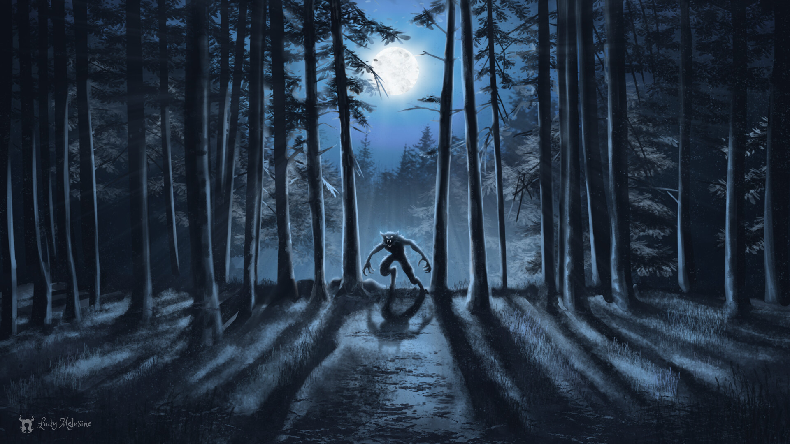

# Bayerische Nächte

| Datum:                     |  02.10.2022                      |
|    ---                     |---                               | 
|**Spielleiter:**| **Julian** |
**Teilnehmer:**                |                                                 **[Marina Adamantidi](../../helden/Marina_Adamantidi/index.md) \|             [Alexander Doppler](../../helden/Alexander_Doppler/index.md) \|               [Friedrich Pfeiffer](../../helden/Friedrich_Pfeiffer/index.md)**|            
| **Veranstaltungsort:**        |            **Casa Dauner**    |
| **Spielzeit:**                | **Freitag 11.12 - Sonntag 13.12.1880**            |
| **Schauplätze:**                | **[Bayernhütte am Brauneck](../../orte/Bayern/Lenggries/Bayernhütte%20am%20Brauneck/index.md) \| [Bad Tölz](../../orte/Bayern/Bad%20Tölz/index.md)**            |

## Prolog

Die Helden werden aus unterschiedlichen Gründen zur Einweihung und ersten Fahrt der ersten bayerischen Seilbahn in [Lenggries](../../orte/Bayern/Lenggries/index.md) eingeladen. Der Veranstalter und Erbauer der Seilbahn ist [Graf Michael Großberg von Tölz](../../personen/Bad%20Tölz/Graf_Michael_Grossberg_von_Toelz/index.md). Marina und ihr Hund [Johnny](../../tiere/Johnny/index.md) investierte die größte Summe, Alexander war maßgeblich am Bau und der Konstruktion beteiligt und Friedrich P. als staatlicher Ehrengast.

Die drei freuten sich auf ein Wochenende voller Skifahren und leckerem Essen. Doch Schneestürme und ein blutiger Unfall führten zu einer Nacht voller Horror und Gewalt.

---

## Hauptteil

Die Helden befinden sich im Wagon der Seilbahn zusammen mit dem Grafen von Tölz und schweben zu den Klängen der Bayernhymne langsam gen Himmel.
Direkt hier ergibt sich das erste Ereignis, ein Schneesturm zieht auf, eine Rolle der Seilbahnführung hat sich gelockert und die Notbremse wurde automatisch eingelegt. Mit seinem mechanischem Fähigkeiten und Wissen über die Bahn schafft es Alexander diese schnell zu reparieren.

An der Bergstation angekommen wird die Gruppe und ihr Gepäck vom steifen Diener [Erik Siebert](../../personen/Bad%20Tölz/Erik_Siebert/index.md) und vom alten aber freudigen Hund des Grafen [Stüpp](../../tiere/St%C3%BCpp/index.md) in Empfang genommen. Von dort geht es in die ca. 1km entfernte [Bayernhütte am Brauneck](../../orte/Bayern/Lenggries/Bayernhütte%20am%20Brauneck/index.md), dem Winteranwesen und Jagdhütte des Grafen. Hier wird gespeißt, entspannt und sich auf die Skifahrt vorbereitet.

Auf zur Abfahrt, welche sich in kurzer Entfernung zur Seilbahn befindet. Die leichte dieser Fahrten ist selbst für unsere Helden zu viel, was sich durch viele Stürze zeigt. Alexander fällt so schwer, dass er sich an der scharfen Kante des Skis den Oberschenkel aufschneidet. Das Nähzeug von Marina und Friedrichs erste Hilfe schafft schnell Abhilfe. Doch diese erste Abfahrt ist beendet und die Gruppe findet sich wieder in der Hütte ein. Es wird sich über die Fähigkeiten der einzelnen Skifahrer amüsiert und schon bald bringt der Diener und auch vorzügliche Koch Erik das Abendessen zu Tisch. Der Graf erfragt die Hintergründe der Helden und bietet seine Bibliothek zur abendlichen Belustigung an. Ebenso wird sich an Alkohol und Zigarren erfreut. Alexander erkundigt sich in Büchern über Wölfe und neueste Technik, Friedrich beschäftigt sich mit der alten Flinte über dem Kamin und Marina studiert die lebensechten Gemälde und die Inneneinrichtung. Dort fällt ihr euch ein sehr mysteriöses Bild mit gespaltenem Motiv auf. Der Graf auf der linken Hälfte umringt von seinen ehemaligen Jagdhunden, darunter auch Stüpp. Auf der anderen Hälfte eine junge Frau, auf einem hölzernen Stuhl sitzend, von Wölfen umgeben.
Die Nacht selbst ist ohne Ereignisse und die Helden schlafen sich in ihren eigenen Stuben aus.

Zum Frühstück bietet Erik Kaffee und Tee und einige Formen von Gebäck an. Wo und wie genau er diese Sachen frisch auf dem Berg auftreibt bleibt sein Geheimnis. Wieder einmal läd der Graf zur Abfahrt ein, Erik will zum Holzhacken gehen. Alexander hält sich auf einem Schlitten zurück und Marina versucht sich noch einmal mit Friedrich. Vom Geschick des Grafen beeindruckt übernimmt sich dennoch niemand und jeder macht seine leichten Abfahrten während der Pudel Johnny sich austobt. Langsam ziehen graue Wolken über der Piste auf und der Graf Michael drängt darauf wieder zur Hütte zurück zu kehren. Immer stärkerer Schneefall bringt die Gruppe zu schnellerem Schritt, doch aus Wind wird Sturm und man erkennt seine eigene Hand kaum noch vor Augen.
"Folgt mir, ich kenne den Weg nur zu gut!" schreit euch Michael entgegen, denn den besagten Weg erkennt man durch die Schneeverwehungen kein bisschen. Nervös geht ihr schon in einigem Abstand den Grafen hinterher doch plötzlich ertönt lautes WOlfsgeheul und ihr haltet inne. Kurz abgelenkt erblickt ihr keine Spur mehr vom Grafen und trottet weiter los. Wieder wie durch Zufall an der Hütte angekommen fehlt jede Spur von Michael und seinem Diener.

Schnell stürmen die Helden in die Sicherheit der Hütte und halten von dort aus Ausschau nach dem Gastgeber und dem Holzfäller. Weiteres Wolfsgeheul hinter der Hütte führt die Gruppe an den Hinterausgang. Friedrich fast den Plan sich an einem Seil befestigt in den Sturm zu wagen, gesichert von Alexander während Marina weiter Ausschau hält. Kurz bevor dieses sich straft stößt er mit seinem Fuß gegen etwas weiches. Vor ihm findet er den zusammenbrechenden Stüpp, welcher von einigen toten Wölfen umringt ist. Dunkles Blut springt aus seinen Venen während sich weitere Wölfe langsam nähern. Als sich Friedrich mit gezogener Waffe langsam zurück zieht durchdringt ein noch tieferer und stärkerer Schrei den Schnee. Jedes Wesen hält inne und sucht nach der Quelle des Geheuls. Bevor Friedrich den riesigen Schatten bemerkt ziehen sich die Wölfe wimmernd zurück. Langsam nähert sich dieser Schatten und die Umrisse verwandeln sich in ein riesiges Biest welches beim Anblick des nun toten Strüpp nochmals laut aufheult. Von Schreck und Angst erfüllt gibt Friedrich einen Schuss aus seinem Revolver ab, ein Volltreffer in die Brust des riesigen Wolfes. Doch dieser ist davon nur leicht beeinflusst und auf jeden Fall nicht begeistert. Der Gendarm versucht zurück zu rennen aber stürzt im tiefen Schnee. Schnell dreht er sich auf den Rücken und schreit lauthals: "Zieht!" Alexander und Marina fangen so gleich an zusammen am Seil zu ziehen und schleifen Friedrich über den glatten Boden. Dieser entlädt seine letzten fünf Schuss in den Riesenwolf während dieser wild auf ihn zustürmt. Getroffen von mehreren Schüssen schafft es dieser dennoch einen Prankenhieb gegen das Bein von Friedrich zu landen bevor er sich zurückzieht. Eine ähnliche rote Spur hinterlässt der verletzte Friedrich als er an der Hütte ankommt. 

"Was ist passiert?" fragen die anderen, "Ein riesiger Wolf hat mich angegriffen, Stüpp ist tot! Und verbindet mein Bein endlich, ich blute wie ein Schwein." lamentiert Friedrich. Marina holt schnell ihr Nähzeug aus der Tasche. "Das wird gleich etwas weh tun..." währende sie ihre Nadel durch seine Haut jagt. Die Blutung gestoppt bringen sie Friedrich in die Jagdhütte und legen ihn behutsam auf dem Sofa ab. Schnell werden die Türen verbarrikadiert. "Das kann kein normaler Wolf gewesen sein, er war viel zu groß und lief teilweise auf zwei Beinen. Noch von keinem Jäger habe ich davon gehört." spricht Friedrich. Alexander erwähnt die Tierkundebücher, Marina die Geschichten und Romane über Fabelwesen. Sowie das mysteriöse Bild des Grafen. Schnell kommt die Gruppe darauf, dass hier etwas nicht ganz stimmt. Friedrich bewaffnet sich zusätzlich mit der alten Flinte während die anderen Beiden die Hütte genauer durchsuchen. Alexander findet im versteckten Dachboden einen mit vielen Kerzen umstellten Altar sowie eine verschlossene Box, Marina eine Buchseite hinter dem Bilderrahmen des merkwürdigen Gemäldes. Ein kurzes Rätsel später enthüllt sich der Inhalt der Box als Buch über okkulte Praktiken mit einer fehlenden Seite. Diejenige hinter dem Bild. Erstaunt, voller Angst und Zweifel blickt sich die Gruppe gegenseitig an.
Also doch ein Werwolf...

Die Helden sammeln schnellstens alles aus Silber in der Hütte, Besteck, Kerzenständer und Teller. Die sagenumwobene Schwäche des Monsters.
Friedrich zerkleinert einiges Silber zu Spänen und füllt damit die Schrotpatronen der Jagdbüchse. Doch die drei werden bei den Vorbereitungen gestört, es klopft an der Hintertür! Der Diener Erik bittet um Einlass.

Es wird ein Plan gefasst und Erik wird unter der Aufsicht der Flinte eingelassen. Er scheint nicht verletzt zu sein und seine Kleidung ist intakt. Doch ohne Silber in seinen Händen ist niemand sicher! Er weigert sich so etwas einfaches zu tun und deshalb wird der Löffel direkt in seinen Mund gestopft. Aufgrund dieser Provokation beginnt ein kurzer Kampfe den Erik aber gegen Alexander und Marina und deren Silberlöffel schnell verliert als er mit dem Kopf auf der Küchentischkante aufschlägt. Von Marina gefesselt wird er mit Silber bestückt in die Abstellkammer gesperrt. Er ist also nicht der Werwolf.

Bevor sich die Helden aber weiter vorbereiten können beginnt wieder das Geheul des Werwolfs. Er ist also direkt beim Haus. Das Biest kratzt an der Hintertür, also zielt Alexander mit der Flinte auf diese. Nach kurzer Einweisung durch Friedrich fühlt er sich jedoch kaum in der Lage den Abzug zu betätigen. Doch als die ersten Holzsplitter durch die Küche fliegen und die Schnauze des Werwolfs durch die Tür ragen braucht es keine Entscheidung mehr. Ein guter Schuss zwingt den Wolf zur erstweihligen Rückkehr. ALs nächstes zersprengt es ein Fenster im Esszimmer, doch Marina ist sofort zur Stelle und wirft mit Besteck nach dem Werwolf. Obwohl es ihn kaum verletzt lässt er vom Fenster ab. Sein nächstes Ziel: die Eingangstür. Die Helden stehen bereit. Friedrich mit dem verletzten Bein über das Sofa gebeugt mit dem Revolver im Anschlag. Marina bewaffnet mit mit mehreren Messern und Gabeln aus feinstem Silber. Und Alexander mit der mächtigen Schrottflinte voller Silberpulver. 

Nach einen Herzschlägen zerberstet die hölzerne Tür! Doch der Werwolf kommt kaum über die Barrikaden und wird nun von allen Seiten beschossen. Feuer aus dem Revolver und der Flinte verletzen ihn zusehends. Doch als die Munition ausgeht und sich die Kreatur zum Angriff aufbäumt springt der kleine Johnny hinter Marina hervor und verbeißt sich in dessen Ohr. Das Frauchen kann ihren Hund nicht alleine lassen und sticht mit ihrem Messer in dessen Pranken. Diese kurze Ablenkung ist genug Zeit zum Nachladen und eine weitere Salve schießt über Marina hinweg. Die geschwächte und blutende Bestie ist aber noch nicht besiegt, doch ein gezielter Hieb zwischen Seine Augen bringt ihn zum Schweigen. Der Werwolf sinkt auf dem Sofa zusammen und haucht sein Leben aus.

---

## Epilog

Die Helden und Erik werden von der Bergwacht und Polizei am 13.12. in der Berghütte aufgefunden und im Polizeipräsidium Bad Tölz befragt. Der brutal getötete Graf und die allgemeine Situation werfen viele Fragen auf, welche aber zu großen Teilen vom vizeGendarmeriechef Friedrich beantwortet oder abgelenkt werden. Es wird davon ausgegangen, dass der Graf unter dem Einfluss von starken und seltsamen Drogen stand. Diese haben ihm extreme Kräfte und Schmerzresistenz verliehen, ihn jedoch gleichzeitig überaus aggressiv gemacht. Daher blieb den Helden nur die Selbstverteidigung übrig und sie werden freigelassen.

Dennoch bleibt ein Verdacht zurück, der die Helden als Mörder sieht. Dieser Verdacht wird sie wahrscheinlich noch einige Zeit verfolgen.

---

## Inventar

- Ein okkultes Buch über Werwölfe auf Lateinisch

---

## Trivia

- Bayerische Nächte ist das erste Abenteuer in der "Bayerische Nächte" Reihe

- Es werden insgesamt zwei Schnittwunden an unterschiedlichen Personen genäht

- Ein Silberlöffel ist keine gute Waffe
 
- Ist aber sehr nützlich gegen Werwölfe

