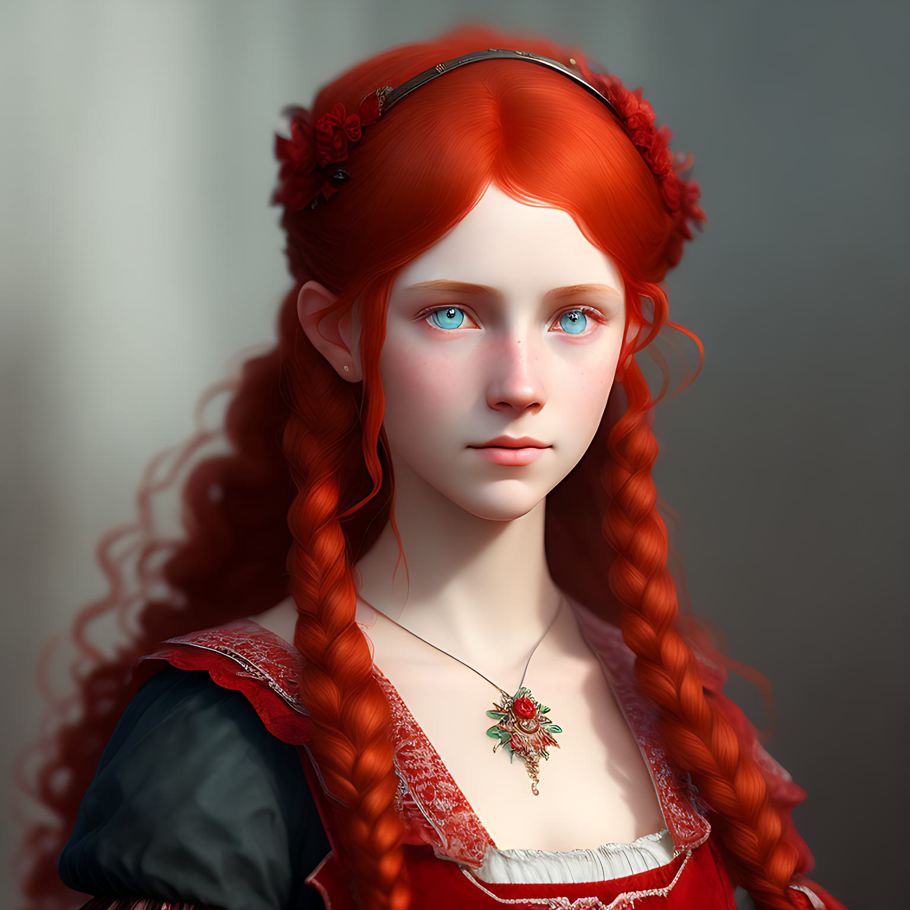

# Anna Siebert

| Name | Anna "Diana Liebold" Siebert |
| ---| ---|
| Spieler | Dana |
| Geburtstag| 7. April 1863 |
| Geburtsort | Bad Tölz |
| Statur | zierlich |
| Familie | [Erik Siebert](<../../personen/Bad Tölz/Erik_Siebert/index.md>) (Vater) |
| Religion | evangelisch |
| Wohnort | Bad Tölz |
| Beruf | Schülerin |
| Affliationen | [Custodire Popolum](../../gruppierungen/Custodire%20Populum/index.md) |
| Titel | |
| Erster Auftritt | [Gefallener Engel](../geschichten/Gefallener%20Engel/index.md) |
| Abenteuer | [Gefallener Engel](../geschichten/Gefallener%20Engel/index.md) |
| | [Alles hat ein Ende, nur die Wurst hat Zwei](../geschichten/Alles%20hat%20ein%20Ende%20nur%20die%20Wurst%20hat%20Zwei/)|
| | [Die Geistersprenger](../geschichten/Geistersprenger/index.md)|

---

## Biographie

Anna wurde am 7. April 1863 als uneheliche Tochter einer Köchin und des Dieners [Erik Siebert](<../../personen/Bad Tölz/Erik_Siebert/index.md>) auf dem Gut Großberg geboren.
Nachdem ihre leibliche Mutter kurz nach Annas Geburt vom Gut floh, wurde sie von mehreren Bediensteten und ihrem Vater groß gezogen.
Auch [Graf Großberg](<../../personen/Bad Tölz/Graf_Michael_Grossberg_von_Toelz/index.md>) versuchte immer wieder, Anna gegenüber eine Vaterfigur einzunehmen.
Annas engste Bezugsperson und Mutterrolle Maria war, aufgrund seiner aufdringlichen Art, stets darauf bedacht, den Grafen von Anna fernzuhalten.

Ihre Kindheit war zunächst von Liebe, Fürsorge und Fleiß geprägt.
Unter der Obhut von mehreren Mägden hat sie früh die Fähigkeiten einer Hausfrau erlernt.
Doch auch in der Schule zeigte sie sich wissbegierig und erbrachte herausragende Leistungen.

Seit dem Alter von 8 Jahren wurde Anna von fürchterlichen Albträumen geplagt. Oft handelten die Träume davon, dass sie sich in einer dunklen Zelle mit dem Grafen befindet, der über sie gebeugt ist und ihr unerträgliche Schmerzen an Armen und Beinen zufügt.
Oft spürte sie diese Schmerzen auch noch, wenn sie aufwachte.
Manchmal hatte das Gesicht des Grafen die Form eines Wolfskopfes mit langen, gelben, gefletschten Zähnen.
Manchmal fühlte sie eine Hitze in ihren Adern, die sie am liebsten hätte zerbersten lassen wollen.
Manchmal konnte sie kleine Stichwunden im Arm am nächsten Morgen erkennen, die sie für Mückenstiche hielt.
Die Albträume kehrten zunächst nächtlich wieder, mit steigendem Alter träumte sie nur noch etwa alle paar Wochen.
Erst im Alter von 15 Jahren brachte Anna den Mut auf, mit ihrer engsten Vertrauten Maria über die Albträume zu reden.
Nachdem Maria nach dem Gespräch wutentbrannt für einige Stunden verschwunden ist, hatte sie zunächst die Entscheidung, ihr davon zu erzählen, zutiefst bereut.
In der nächsten Nacht sollten sich die Träume allerdings in Luft aufgelöst haben. Maria ist ihr seitdem nicht mehr von der Seite gewichen.

Annas Beziehung zu ihrem Vater war distanziert. Sie sprach mit ihm nie über Gefühle, ihre Unterhaltungen verliefen stets oberflächlich.
Zwar hat Erik über die Jahre hinweg versucht, eine engere Vater-Tochter-Beziehung aufzubauen, jedoch war er dabei etwas unbeholfen und seine freundschaftliche Beziehung zum Grafen war Anna, aufgrund ihrer Träume, nicht geheuer.

Anna war im Alter von 17 Jahren in einer Vollmondnacht alleine im Wald spazieren. In dieser Nacht verwandelte sie sich in einen Werwolf.
Während dieser Verwandlung war sie zutiefst verunsichert und unkontrolliert, zerstörte einen beachtlichen Teil des Waldes und riss ein paar Rehe und Hirsche. Zu ihrem Glück, war in dieser Nacht keine menschliche Seele zugegen.

In der Morgendämmerung verwandelte sie sich in ihre Menschengestalt zurück.
Vollkommen verängstigt, gelang es ihr, nackt wie sie durch die Verwandlung war, rechtzeitig zum Anwesen zurück bekommen, bevor jemand etwas bemerken konnte.
Sie behielt dieses Ereignis für sich und hoffte, dass sie das alles nur geträumt hätte. Schließlich waren ihre Albträume mit dem Grafen ähnlich real.
Der einzige Unterschied war, dass sie in dieser [Werwolfsnacht](../../monster/werwolf/index.md) nie geschlafen hat.

Als der Morgen fortgeschritten und wieder Leben im Anwesen eingekehrt war, machte sich eine Unruhe unter den Bewohnern breit.
Die Nachricht, dass der Graf letzte Nacht gestorben ist, machte die Runde. Anna war schockiert und befürchtete, dass sie damit etwas zu tun haben könnte.
Ihre Erinnerung an die Geschehnisse während ihrer waren lückenhaft, da sie sich nicht unter Kontrolle hatte und rein instinktiv handelte. Sie konnte sich sehr gut an Gerüche und Geräusche erinnern, nicht aber an Abläufe von Ereignissen und Bilder. Später erfuhr sie allerdings, dass der Graf in Werwolfgestalt von Zivilisten getötet wurde.

Einige Wochen später wurde sie von der [Custodire Popolum](../../gruppierungen/Custodire%20Populum/index.md) aufgenommen, bei der sie die Leute auf einer [Sitzung](../../geschichten/Gefallener%20Engel/index.md) in [Nürnberg](../../orte/Bayern/Nürnberg/index.md) kennen lernte, die den Grafen auf dem Gewissen hatten.
In der Hoffnung, sie könnte von den Leuten mehr über Werwölfe lernen, schloss sie sich der Gruppe an.
Vielleicht fänden sie ja eine Möglichkeit, sie von der Lycanthrophie zu befreien.

---

## Inventar und Begleiter

- Beil

---

## Fähigkeiten

[Charakterbogen (Mensch)](./Anna_Siebert.pdf)

[Charakterbogen (Werwolf)](./Anna_Werwolf.pdf)
