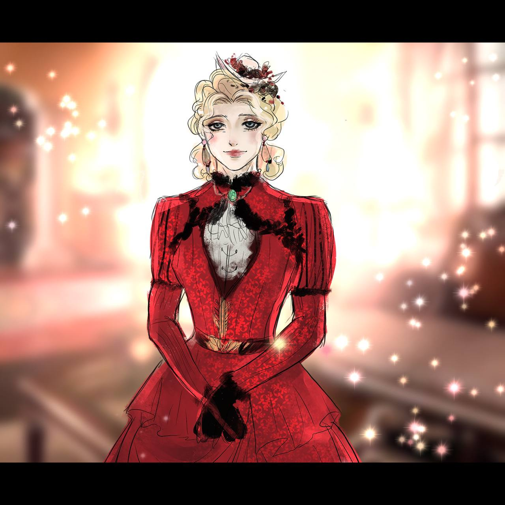

# Marina Adamantidi

| Name | Marina Adamantidi|
| ---| ---|
| Geburtstag| 1845 |
| Geburtsort | Nafplio |
| Statur | elegant groß |
| Familie | [Friedrich Ritter von Burger](../Friedrich%20Ritter%20von%20Burger/index.md) (Mann) |
|  | Luitpold Ritter von Burger (Sohn) |
|  | Ludwig Ritter von Burger (Sohn) |
| Religion | christlich orthodox |
| Wohnort | Starnberg |
| Beruf | Geschäftsfrau |
| Religion | christlich orthodox |
| Affliationen | |
| Titel | von Burger |
| Erster Auftritt | [Bayerische Nächte](../../geschichten/Bayerische_Naechte/index.md) |

---

## Biographie

---

## Inventar und Begleiter

Pudel [Johnny](../../tiere/Johnny/index.md), gut trainiert durch Bedienstete und das Frauchen

- Handtasche

    - Lippenstift, rot

    - Taschentuch

    - Nähzeug

    - Kamm

- Immer gefüllte Geldbörse

---

## Fähigkeiten

[Charakterbogen](../Marina_Adamantidi/Marina.pdf)

