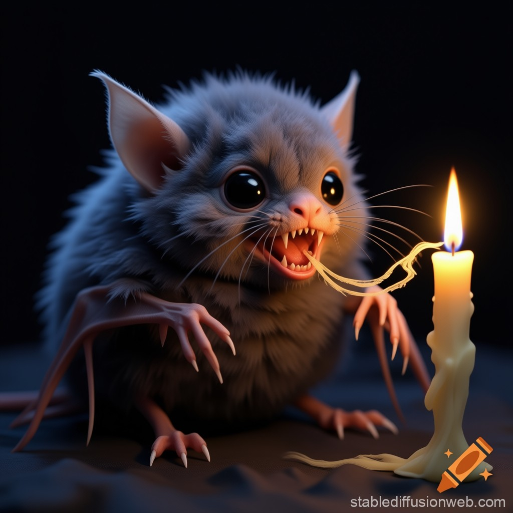

# Thermimp

Das Monster lebt in absoluter Dunkelheit. Mag Feuchtigkeit und saugt Feuer auf. Gerade in Minen oder Tunnel sorgte es früher für viele verwirrte Menschen oder gar Tote, da man sich in der Dunkelheit nur schwer orientieren konnte. Erst mit der Elektrizität scheint man Höhlen wo es haust zu erleichtern, da es die Hitze des Glühdrahtes nicht schnell genug aufsaugen kann. Es tritt in Schwärmen auf und versucht Eindringlinge zu verscheuchen oder zu fliehen. Es haust in Ritzen in der Wand und jagt kleine Tiere.
Bei der Belagerung von Gibraltar konnte der Thermimp fast die Verteidigung der Briten lahmlegen. Doch ein Vorfahre von Haja, ihr Urgroßvater, konnte die Tiere fangen. Erst viel später entkamen sie den Käfigen.

## Aussehen

## Fähigkeiten

## Schwächen

