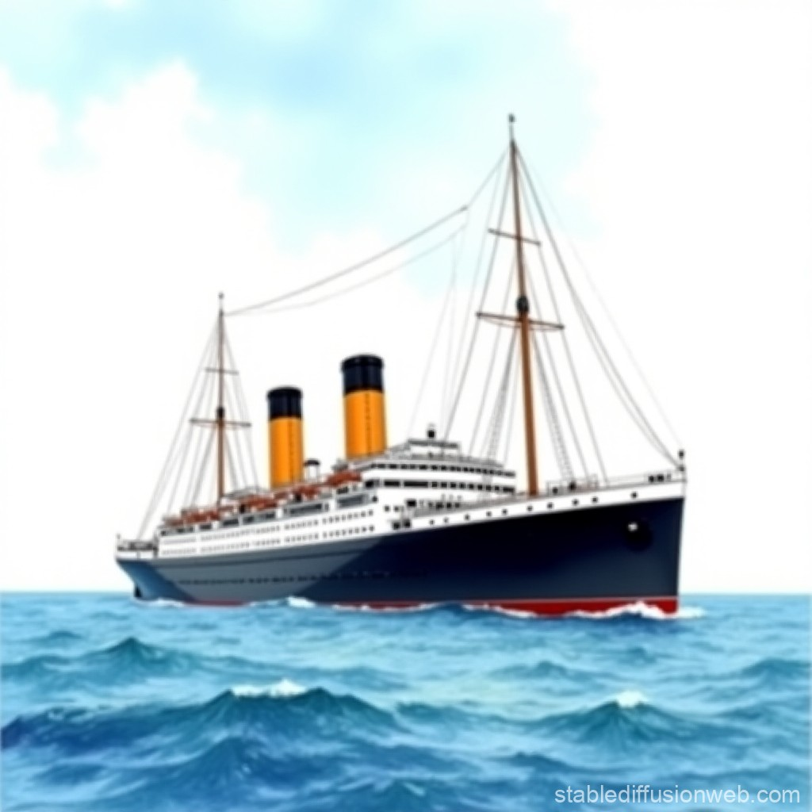
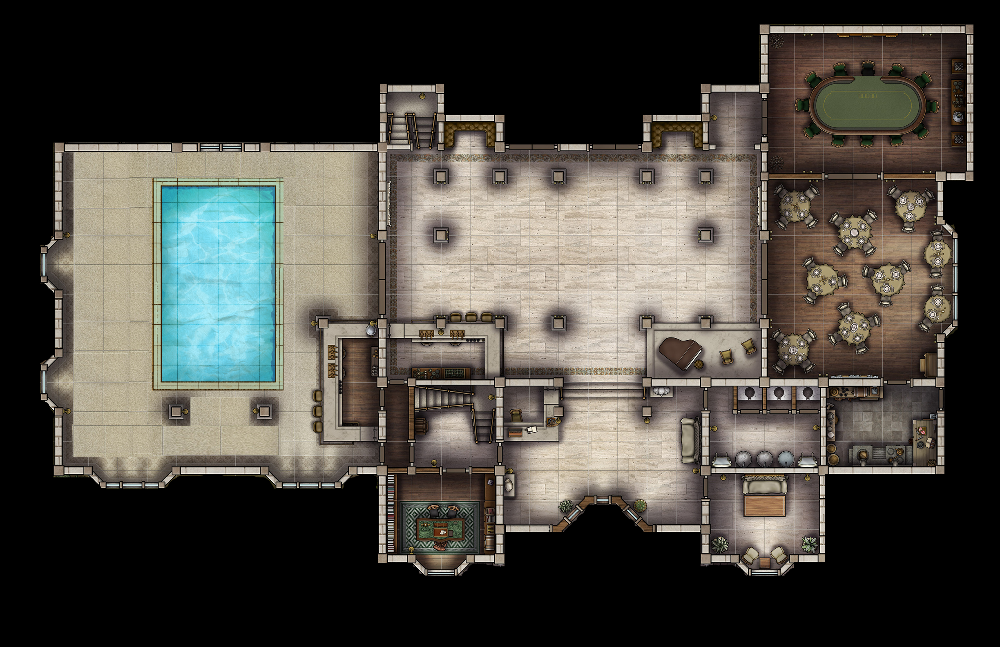
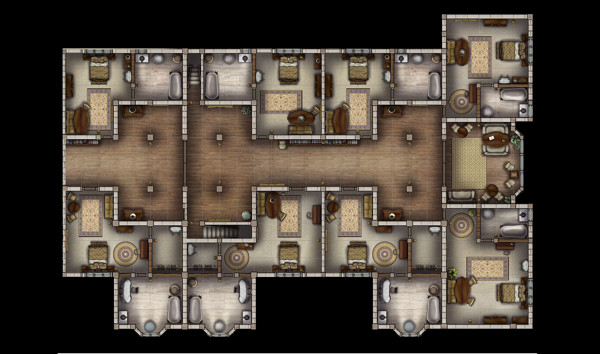

# Die Ostfriesland

Hauptschauplatz des Abenteuers [公海上での殺人事件](../../geschichten/Kō%20kaijō%20no%20satsujin/index.md), gebaut von der Hamburger Werft, ein Teil der Berkshire Holdings unter [Sir Charles](../../personen/London/Sir%20Charles%20of%20West%20Harborough%20and%20Suttings/index.md).

Im Luxusbereich gibt es ein Oberdeck mit Schalfgemächern und ein Unterdeck mit Esssaal und Amüsieretablissements.

